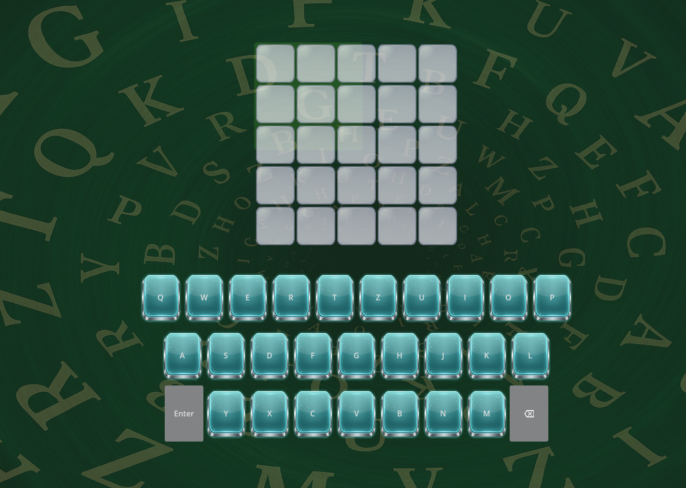

# Wordle Clone - A Godot Learning Project
This project started as a small experiment to see whether I could recreate the core mechanics of Wordle inside the Godot Engine.
I wanted to understand how to structure UI‑heavy gameplay, handle keyboard input, manage game state, and implement the validation logic behind the original game.

What began as a simple test quickly turned into a fun challenge — and this project is the result.
It’s not meant to be a full clone with thousands of words or polished UI yet, but a focused learning project that demonstrates gameplay logic, input handling, and Godot’s scene‑based architecture.

---

---

## Features
- Fully functional Wordle-style guessing system
- Word validation against a custom word pool
- Full oon-screen keyboard with hover and press effects
- Physical keyboard support
- Dynamic tile coloring based on validation state

## Architecture Overview
- Godot 4.6
- GDScript

### Main Components
- main.gd
  - Coontrols rows, active letter index and game flow
  - Handles keyboard input
  - Performs word validation
  - Manages win/lose state
- keyboard.gd
  - Emits signals for letter, enter and backspace
  - Updates key states after validation
- results_ui.gd
  - Displays win/lose screen
  - Shows the correct word
  - Allows restarting the game

## Known Issues & Work in Progress
This Project is still evolving.
Some parts were implemented quickly to test functionality and will be polished later.
Current limitations:
- No main menu yet
- UI design is not fully unified
- Some keyboard buttons still neer proper styling
- Word pool is very limited by now
- no animations yet

## Roadmap
Planned improvements:
- Main menu
- Better UI consistency
- More words
- Small animations
- Sound effects
- Settings Menu

## Personal Note
This project was a great way to explore Godot’s UI system, signals, and input handling.
I learned a lot about structuring gameplay logic, managing state, and building reusable components like the keyboard and results UI.

It’s not meant to be a perfect clone — but a solid learning project that I’m proud of and plan to expand when I have time.

## Running the Project
Simply open the project folder in Godot and press Play
